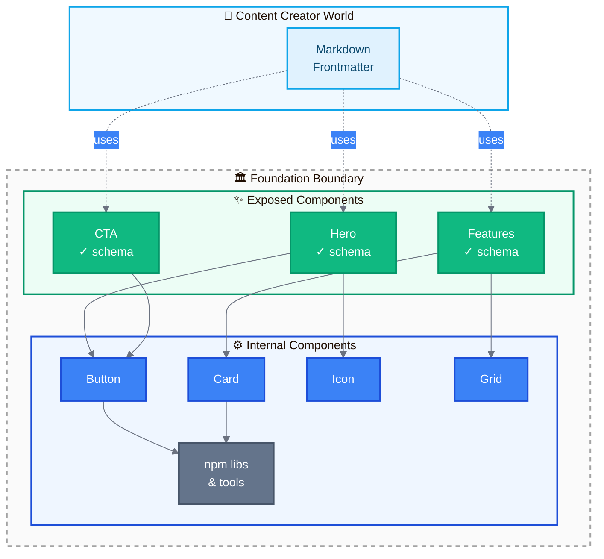
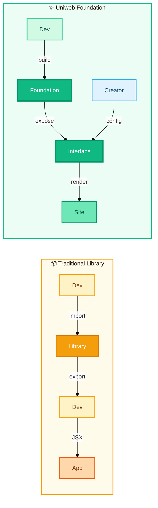
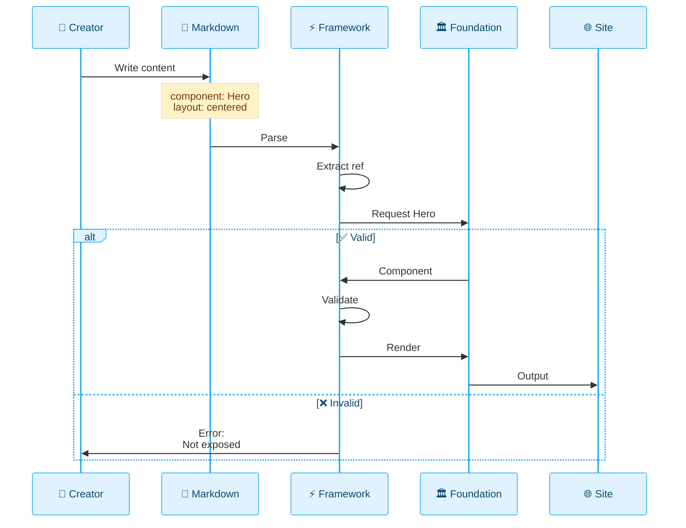
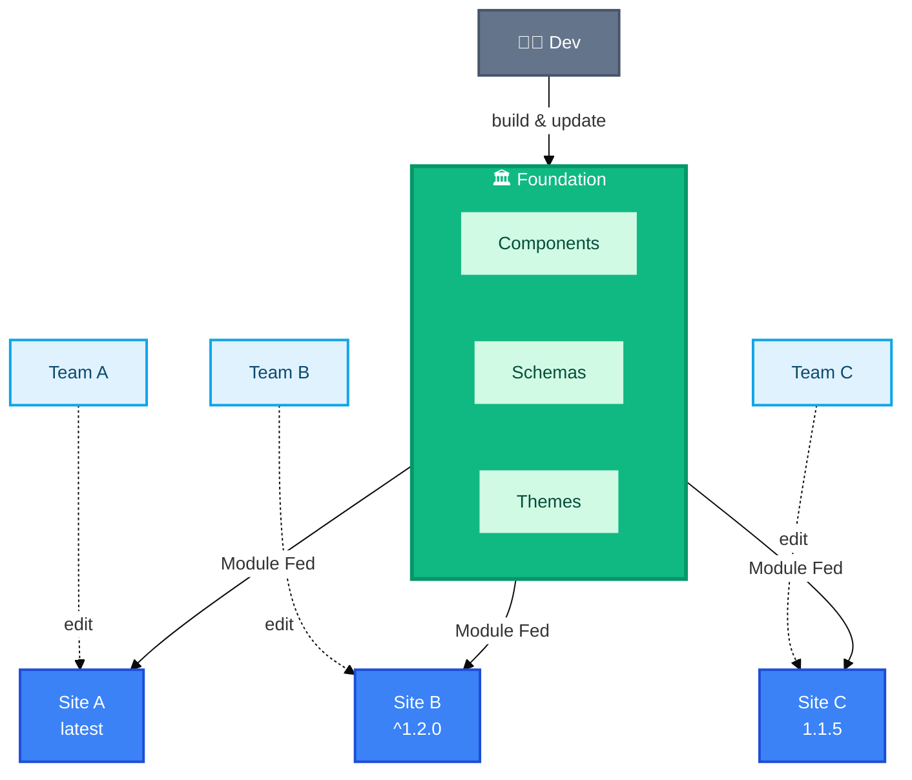
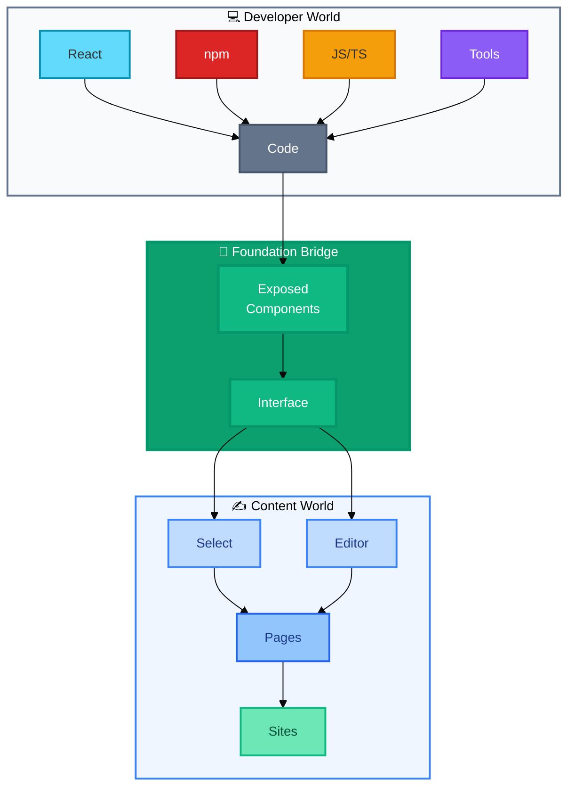
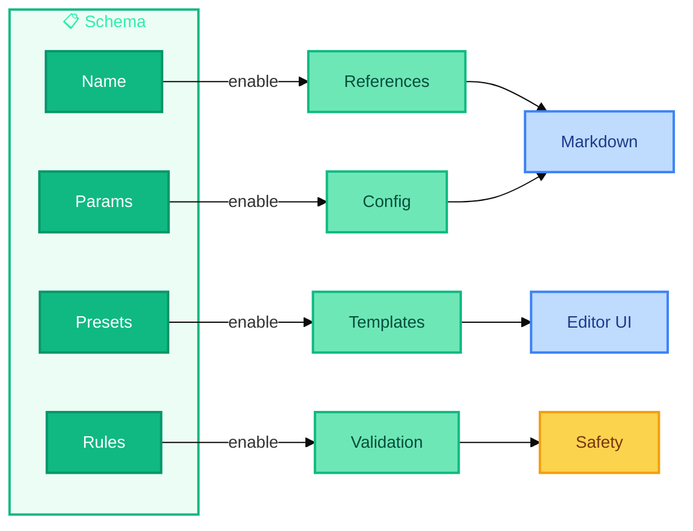
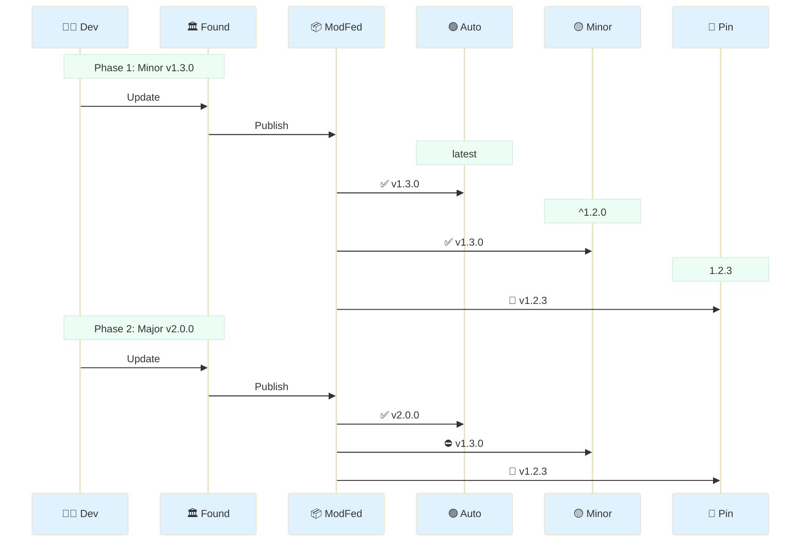
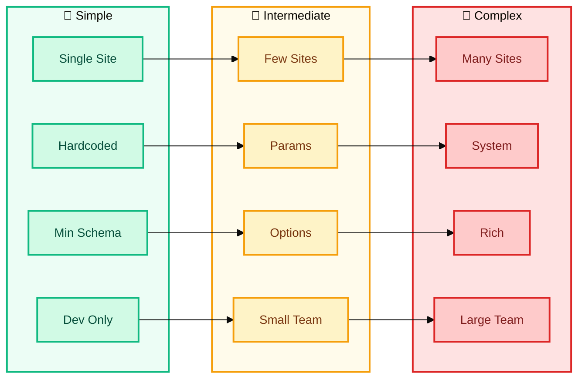

# Uniweb Framework: Visual Concepts

This document provides visual diagrams to help understand the core architectural concepts of Uniweb.

## 1. The Foundation Boundary: Exposed vs Internal Components

**💡 Key insight:** Content creators only interact with exposed components (green). Internal components (blue) are implementation details using standard npm packages.

## 2. Traditional Component Library vs Foundation

**💡 Key insight:** Traditional libraries have dev-to-dev interfaces. Foundations have content-facing interfaces for declarative composition.

## 3. Content Flow: From Markdown to Rendered Site

**💡 Key insight:** The Framework validates that content references exist in the Foundation's schema before rendering.

## 4. Foundation Serving Multiple Sites

**💡 Key insight:** One Foundation serves multiple sites. Each controls its update strategy via version config. Updates propagate at runtime without redeployment.

## 5. The Two Worlds Connected by Foundation

**💡 Key insight:** Foundations bridge developers (code/npm) and creators (config/editors). The schema-defined interface connects them.

## 6. Schema-Driven Architecture

**💡 Key insight:** The schema is the contract. It defines what creators can reference, configure, and validates at build time. Powers editor integration.

## 7. Update Propagation Flow

**💡 Key insight:** Sites control update propagation via version strategies. Module Federation loads appropriate versions at runtime—no redeployment needed.

## 8. Progressive Complexity Spectrum

**💡 Key insight:** Start simple and grow. The framework supports the entire spectrum without architectural rewrites.

---

## Summary

These diagrams illustrate the core architectural principles of Uniweb:

1. **🏗️ Boundary-based design**: Clear separation between exposed (content-facing) and internal (developer) components
2. **🔄 Dual interfaces**: Traditional code interfaces for internal development, declarative interfaces for content creators
3. **📋 Schema as contract**: Component schemas define the content-facing API and enable validation and tooling
4. **🎯 Single source of truth**: One Foundation serves many sites with controlled update propagation
5. **🌉 Two-world bridge**: Connects the developer ecosystem (React, npm) with the content creator ecosystem (markdown, visual editors)
6. **📈 Progressive complexity**: Supports everything from simple single-site projects to enterprise design systems

**The Foundation is the bridge** that connects these concepts, providing a content-facing interface while maintaining standard React development practices internally.
