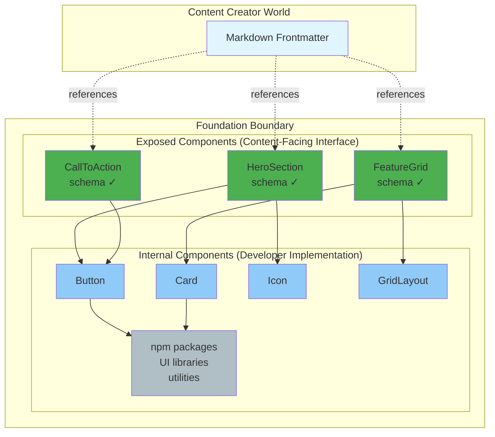
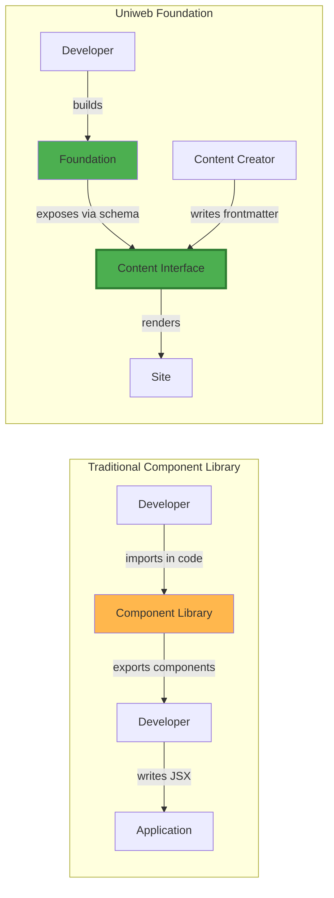
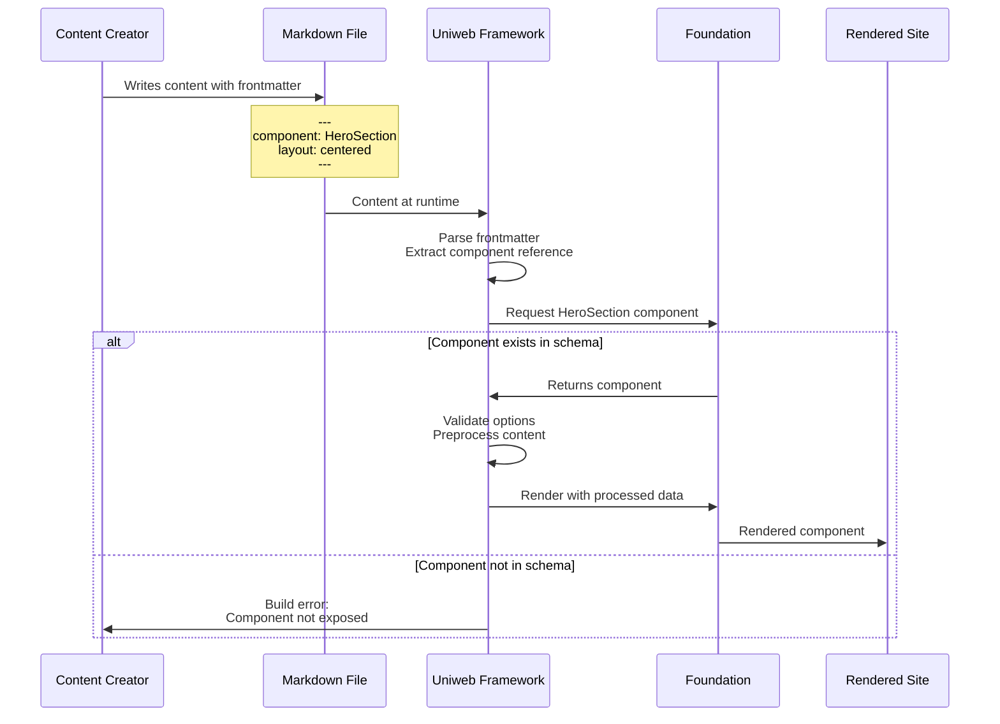
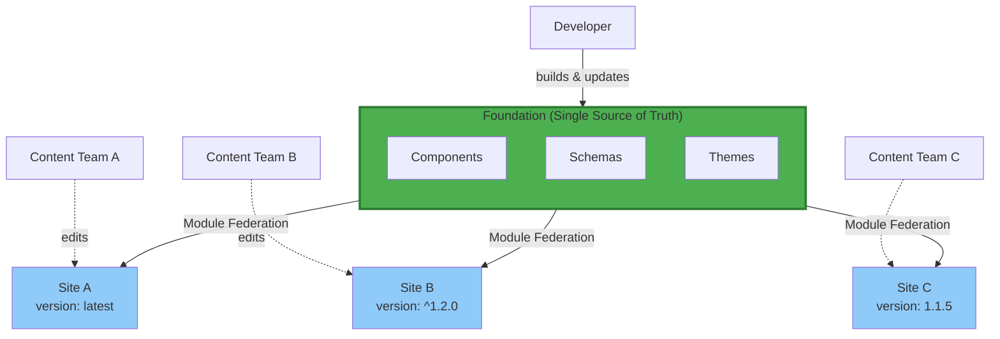
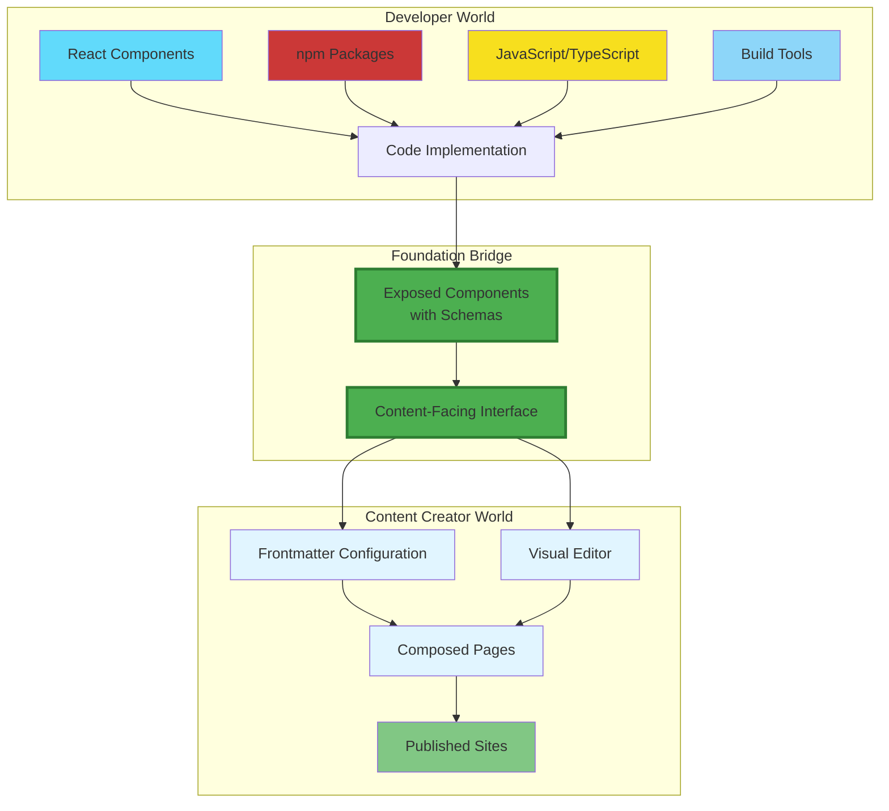
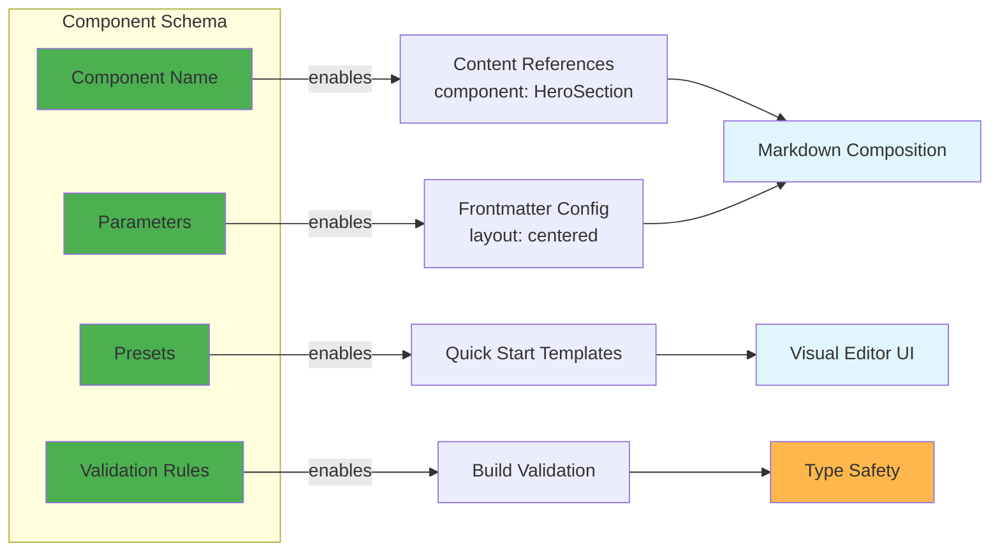
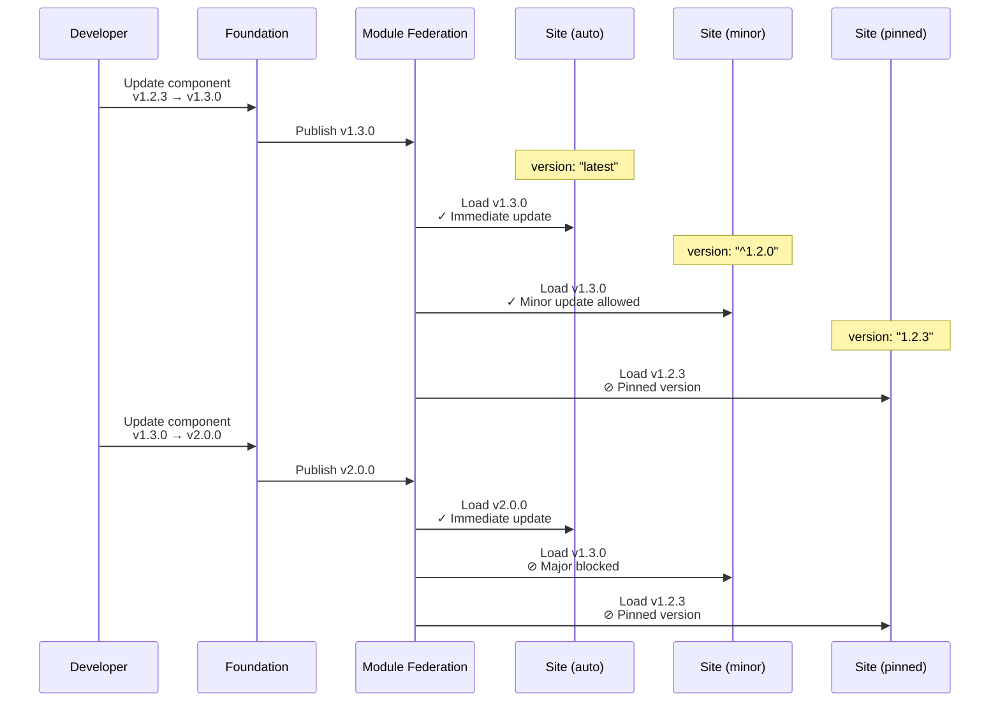

# Uniweb Framework: Visual Concepts

This document provides visual diagrams to help understand the core architectural concepts of Uniweb.

## 1. The Foundation Boundary: Exposed vs Internal Components



**Key insight:** Content creators only interact with exposed components (green). Internal components (blue) are pure React implementation details using standard npm packages and composition patterns.

## 2. Traditional Component Library vs Foundation



**Key insight:** Traditional libraries have developer-to-developer interfaces. Foundations have content-facing interfaces designed for declarative composition.

## 3. Content Flow: From Markdown to Rendered Site



**Key insight:** The Framework acts as the bridge, validating that content references exist in the Foundation's schema before rendering.

## 4. Foundation Serving Multiple Sites



**Key insight:** One Foundation serves multiple sites. Each site controls its update strategy through version configuration. Updates propagate at runtime without site redeployment.

## 5. The Two Worlds Connected by Foundation



**Key insight:** Foundations bridge two worlds. Developers work with code and npm packages. Content creators work with declarative configuration and visual editors. The schema-defined interface connects them.

## 6. Schema-Driven Architecture



**Key insight:** The component schema is the contract. It defines what content creators can reference, configure, and validates at build time. It also powers visual editor integration.

## 7. Update Propagation Flow



**Key insight:** Sites control how updates propagate through version strategies. Module Federation loads the appropriate version at runtime—no site redeployment needed.

## 8. Progressive Complexity Spectrum

```mermaid
graph LR
    subgraph "Simple"
        direction TB
        S1[Single Site]
        S2[Hardcoded Components]
        S3[Minimal Schemas<br/>name only]
        S4[Developer-Only Team]
        style S1 fill:#c8e6c9
        style S2 fill:#c8e6c9
        style S3 fill:#c8e6c9
        style S4 fill:#c8e6c9
    end
    
    subgraph "Intermediate"
        direction TB
        M1[Few Related Sites]
        M2[Parameterized Components]
        M3[Schema Options<br/>+ validation]
        M4[Small Content Team]
        style M1 fill:#fff59d
        style M2 fill:#fff59d
        M3 fill:#fff59d
        M4 fill:#fff59d
    end
    
    subgraph "Complex"
        direction TB
        C1[Many Client Sites]
        C2[Design System]
        C3[Rich Schemas<br/>+ presets + theming]
        C4[Large Content Teams<br/>+ Visual Editor]
        style C1 fill:#ffab91
        style C2 fill:#ffab91
        style C3 fill:#ffab91
        style C4 fill:#ffab91
    end
    
    S1 --> M1
    M1 --> C1
    S2 --> M2
    M2 --> C2
    S3 --> M3
    M3 --> C3
    S4 --> M4
    M4 --> C4
```

**Key insight:** Start simple (single site, minimal schemas) and grow as needs evolve. The framework supports the entire spectrum without requiring architectural rewrites.

---

## Summary

These diagrams illustrate the core architectural principles of Uniweb:

1. **Boundary-based design**: Clear separation between exposed (content-facing) and internal (developer) components
2. **Dual interfaces**: Traditional code interfaces for internal development, declarative interfaces for content creators
3. **Schema as contract**: Component schemas define the content-facing API and enable validation and tooling
4. **Single source of truth**: One Foundation serves many sites with controlled update propagation
5. **Two-world bridge**: Connects the developer ecosystem (React, npm) with the content creator ecosystem (markdown, visual editors)
6. **Progressive complexity**: Supports everything from simple single-site projects to enterprise design systems

The Foundation is the bridge that connects these concepts, providing a content-facing interface while maintaining standard React development practices internally.
